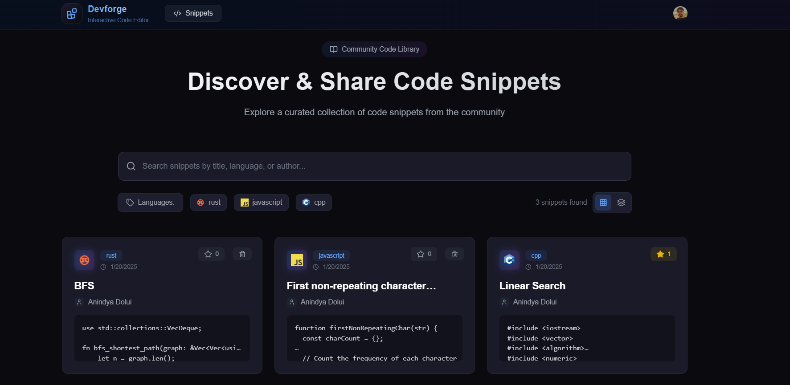
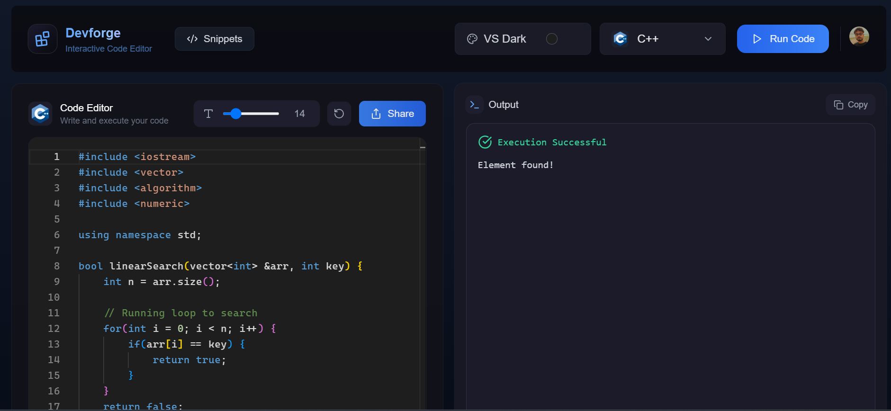
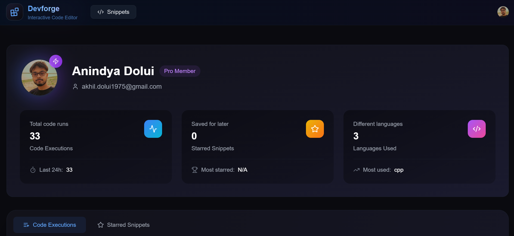
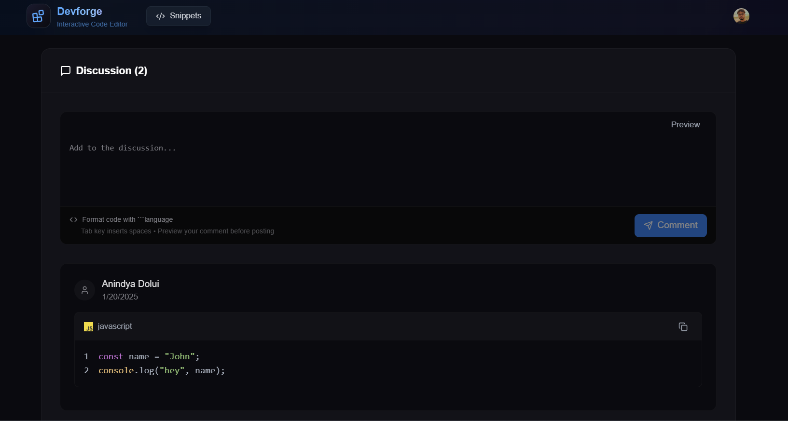
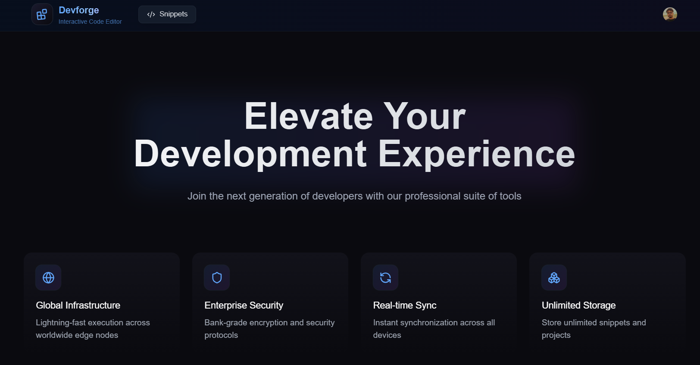
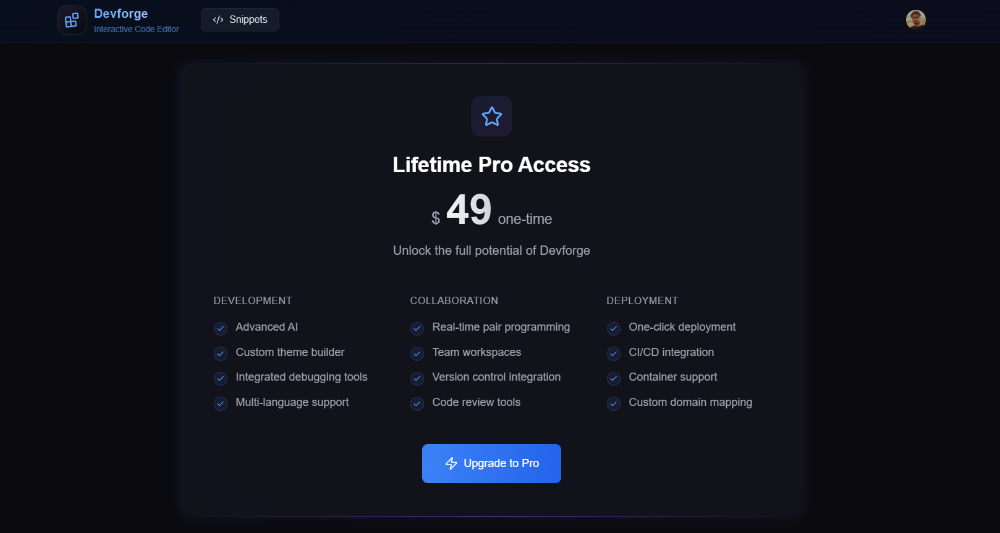
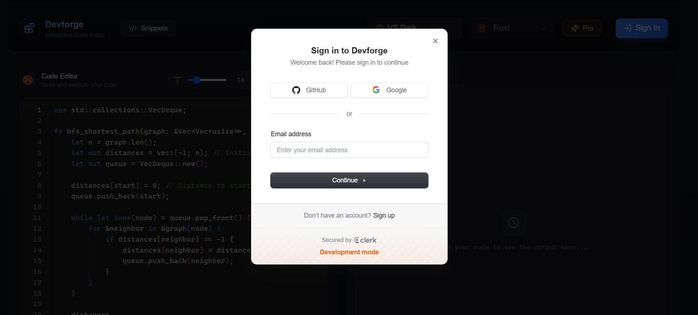
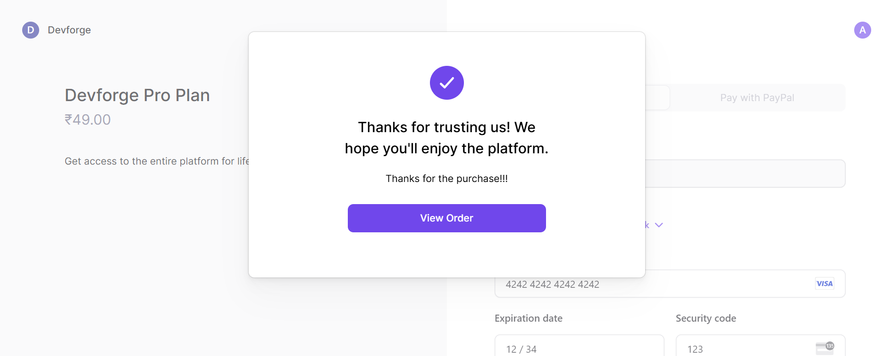
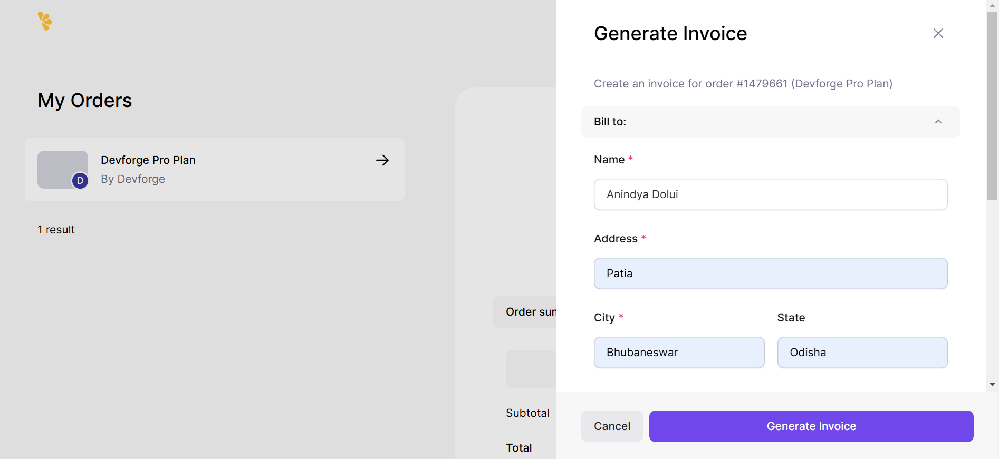

<h1 align="center">✨ SaaS Code Editor (Devforge) - Next.js 15 ✨</h1>

<h3 align="center"></h3>

Highlights:

- 🚀 Tech stack: Next.js 15 + Convex + Clerk + TypeScript
- 💻 Online IDE with multi-language support (10 languages)
- 🎨 Customizable experience with 5 VSCode themes
- ✨ Smart output handling with Success & Error states
- 💎 Flexible pricing with Free & Pro plans
- 🤝 Community-driven code sharing system
- 🔍 Advanced filtering & search capabilities
- 👤 Personal profile with execution history tracking
- 📊 Comprehensive statistics dashboard
- ⚙️ Customizable font size controls
- 🔗 Webhook integration support
- 🌟 Professional deployment walkthrough

### Screenshots












# Devforge - Interactive Code Editor

Devforge is an online code editor built to provide an interactive, seamless, and customizable coding experience. Inspired by the look and feel of Visual Studio Code (VS Code), Devforge allows developers to write, test, and run code across multiple programming languages. With a variety of themes and support for multiple languages, Devforge also features a Pro plan that unlocks additional languages and premium features.

## Features

- **Multi-Language Support**: Initially supports JavaScript, with more languages unlocked through a Pro subscription.
- **Monaco Editor**: Built using Monaco Editor, providing a VS Code-like experience with intelligent code completion, syntax highlighting, and more.
- **Theming**: Offers various themes for a personalized coding experience.
- **Pro Subscription**: One-time lifetime payment for access to all languages and premium features (e.g., code execution history, unlimited snippets).
- **Snippet Management**: Upload and manage code snippets with the ability to add comments and descriptions.
- **Snippet Search**: Search snippets by filters or keywords to easily find relevant code.
- **User Dashboard**: Track your code execution history, the number of snippets uploaded, and which snippets are starred.
  
## Tech Stack

- **Frontend**: tailwind, React
- **Backend**: Convex (Database), TypeScript (for API and server-side logic)
- **Authentication**: Clerk (user authentication)
- **Payments**: Lemon Squeezy (for Pro plan subscriptions)
- **State Management**: React Context API and custom webhooks
- **Other Libraries**: Framer Motion (for animations), Lucide (icons)

### Installation Steps

- Clone the repository:

   ```bash
   git clone https://github.com/aninxya07/devforge.git
   cd devforge

- Install dependencies:
    ```bash
    npm install


- Set up .env.local file:
    ```bash
    - NEXT_PUBLIC_CONVEX_URL=your_convex_url
    - CLERK_FRONTEND_API=your_clerk_frontend_api
    - CLERK_API_KEY=your_clerk_api_key
    - NEXT_PUBLIC_LEMON_SQUEEZY_API_KEY=your_lemon_squeezy_api_key
    
- Run the application:
    ```bash
    - npm run dev
- Visit http://localhost:3000 to start using Devforge!


### License
This project is licensed under the MIT License - see the LICENSE file for details.

### Acknowledgements
Monaco Editor for providing the code editor engine
Clerk for easy authentication and user management
Convex for the real-time database solution
Lemon Squeezy for payment processing

### Contributing
Feel free to fork the repository, open issues, and submit pull requests. Contributions are welcome!
